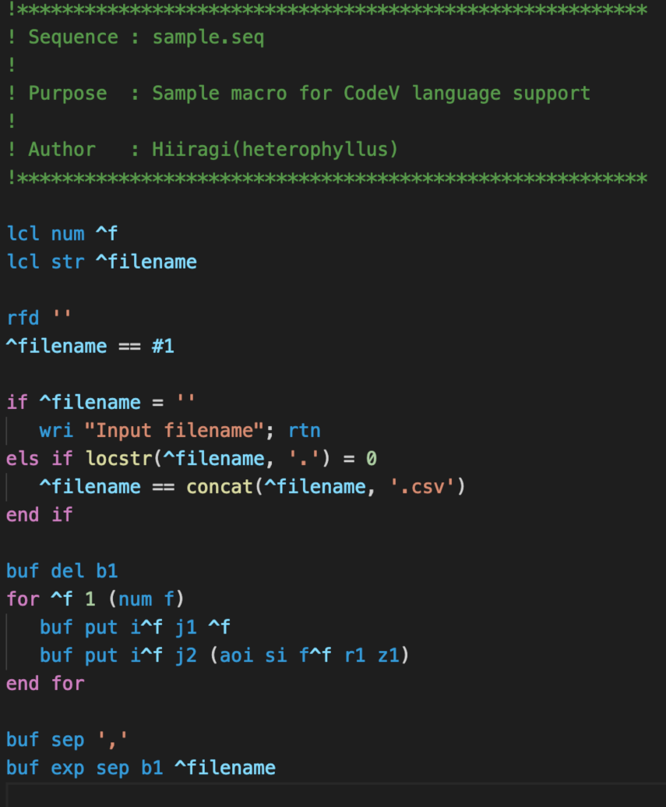

# CodeV Macro-plus language support for Visual Studio Code

This extension adds syntax highlighting for [CodeV](http://optics.synopsys.com/codev/) Macro-plus scripts.

## Screenshot

## Changelog
Read the CHANGLELOG to know what has changed over the last few versions of this extension.

## License
This extension is licensed under MIT license. See [LICENSE](LICENSE) file for details.

## Contributing
Contributions are greatly appreciated. Please fork this repository and open a pull request to add snippets, make grammar tweaks, etc.
